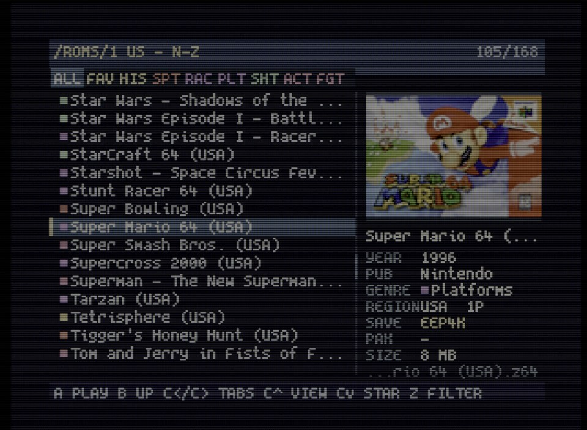
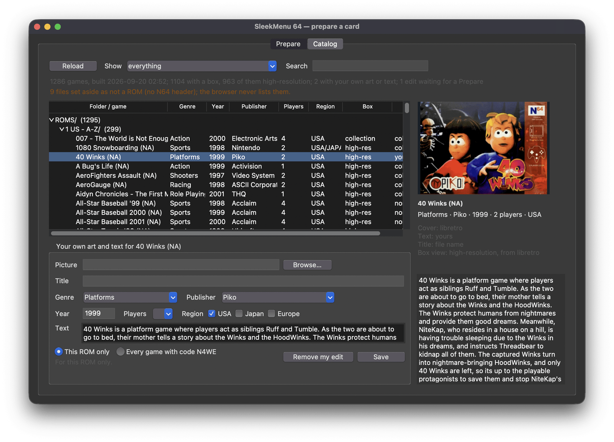
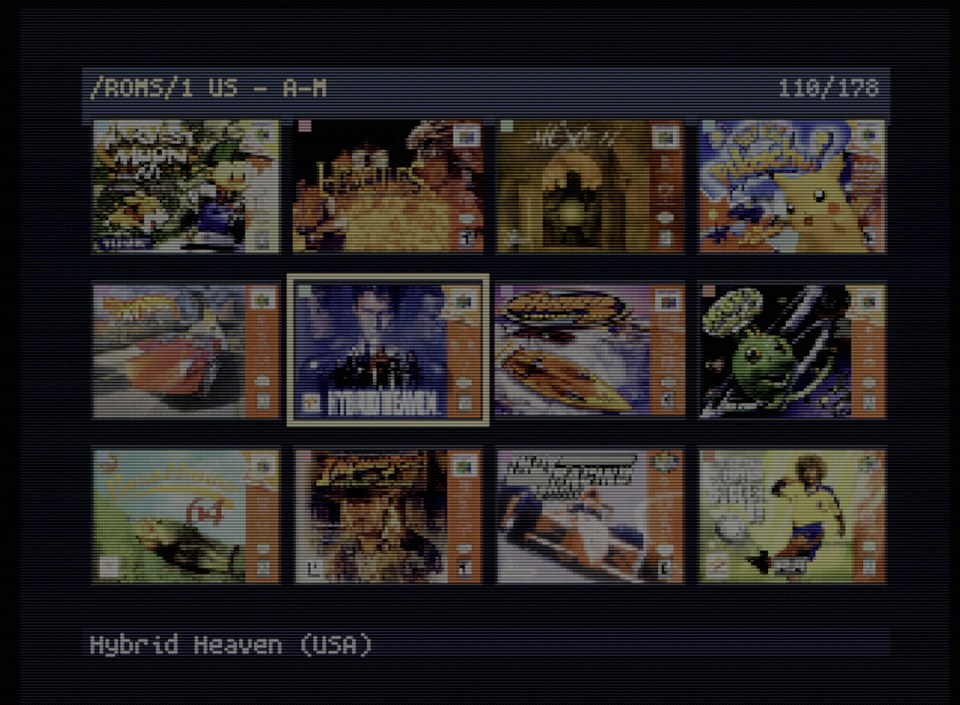
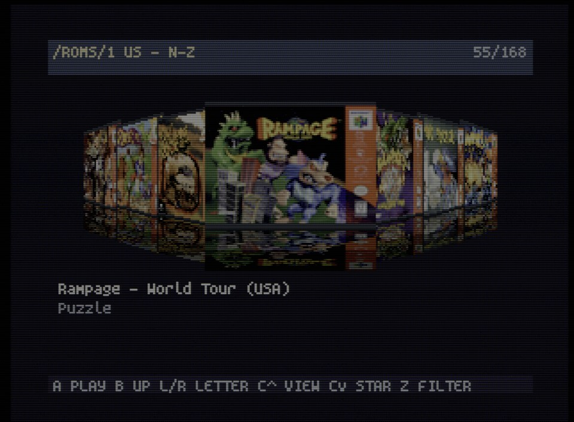
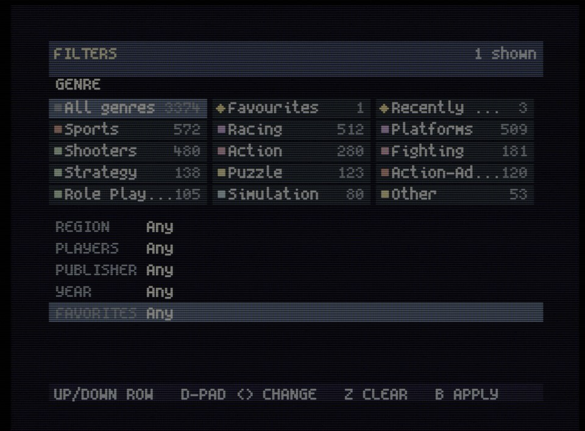

# SleekMenu 64

A game browser for the EverDrive-64. It is an ordinary N64 ROM that you start
from the EverDrive's own menu: it shows your library with box art, genres,
descriptions and filters, and boots the game you pick. The EverDrive's menu
stays where it is — SleekMenu sits beside it on the card, and a reset or a
power cycle brings the stock menu back.

Works on the EverDrive-64 X7 and the EverDrive-64 Pro with one and the same
ROM. Saves go to the same `ED64/gamedata/` folder the stock menu uses, so a
game started from either menu carries its save into the other.



## What you need

- An EverDrive-64 X7 (OS 3.11) or an EverDrive-64 Pro, with your ROMs on
  the card in any folders you like — `ROMS`, `Games`, several, or none.
- A Mac, a Windows PC or a Linux computer to prepare the card, with
  nothing to install.

## Install

**1. Download two files** from the
[releases page](https://github.com/CathodeJay/sleekmenu64/releases/latest):
`SleekMenu64.z64`, the browser, and the prep GUI for your computer.

| Your computer | The prep GUI |
|---|---|
| Mac with Apple silicon (M1 and later) | `SleekMenu-Prep-mac-arm64.zip` |
| Mac with an Intel processor | `SleekMenu-Prep-mac-intel.zip` |
| Windows | `SleekMenu-Prep-windows.exe` |
| Linux | `SleekMenu-Prep-linux` |

**2. Copy `SleekMenu64.z64` to the root of the card**, next to your games.

**3. Open the prep GUI.** On a Mac, unzip it first. It is not code-signed,
so the first launch warns:

- **macOS 15 and later:** open it once, close the warning, then in System
  Settings → Privacy & Security press Open Anyway. On macOS 14 and
  earlier, right-click the app and choose Open.
- **Windows:** More info → Run anyway.
- **Linux:** make it runnable first: `chmod +x SleekMenu-Prep-linux`.

**4. Prepare the card.** The prep GUI picks the card when it is the only
removable disk. The first time, press **Download**: it fetches the box art
and descriptions onto the card, once (about 52 MB). Then press **Prepare**.
A card of three thousand games takes under a minute.

**5. Eject the card, put it in the cart, and start `SleekMenu64.z64` from
the EverDrive menu.** Press Start on a game to play it, A for its details.
To get back to the EverDrive menu, reset the console.

**Adding games later:** copy them onto the card, open the prep GUI, press
Prepare. It takes seconds, since only what changed is read. A game copied
on plays from the browser straight away, but has no box or facts until
then.

The box art and descriptions come from
[n64-flashcart-menu-metadata](https://github.com/n64-tools/n64-flashcart-menu-metadata/releases),
a public-domain collection of box scans and descriptions for every
cartridge, shared with other N64 menus. SleekMenu ships none of it:
Download puts its `release-metadata.zip` on the card, where it is read in
place from then on.

What the tool writes, and what it leaves alone:

```text
/release-metadata.zip      the box-art collection, fetched once and read in place
/sleekmenu/catalog.ebc     titles, genre, publisher, year, descriptions
/sleekmenu/catalog.json    the same, readable, with where every field came from
/sleekmenu/covers.pak      every cover in one file
/sleekmenu/covers-large.pak the same covers at 256×180, for the box view
/sleekmenu/favorites.txt   written by the browser as you star games
/sleekmenu/history.txt     the last fifteen games you launched
/sleekmenu/cheats.txt      which cheats are on, per game
/ED64/gamedata/            saves, shared with the EverDrive menu — never touched
```

Both the catalog and the covers are optional: with no catalog the browser
scans the card and shows filenames, with no covers it draws a placeholder.
The tool never moves, renames or deletes anything on the card, apart from
a picture or text of your own in `sleekmenu/art/` when you press Remove my
edit in the prep GUI.

## The prep GUI

The same tool as `sleekmenu-prep.pyz`, in a window: pick the card, prepare
it, and see it the way the browser will before it goes back in the
console — every game, its box, where each fact came from — and give any
game your own picture, text or facts.

[Install](#install) says which download is yours and what to click the
first time. With Python and Tk installed, `python3 sleekmenu-prep.pyz --gui`
opens the same window.

### Prepare

- **Card** is picked for you when it is the only removable disk; Browse and
  Refresh otherwise. The line under it counts the games copied on since the
  last Prepare, which is when a card wants one: the catalog is built here,
  not on the console, so a game copied on plays from the browser straight
  away but has no box or facts until the next run.
- **Games folder** is empty for the whole card, or names one folder
  (`ROMS`) to catalog only that. The card remembers the choice.
- **Collection** says, in the line under it, whether the card has the
  box-art collection: a green tick with the number of boxes, or an amber
  cross saying what to do. Download fetches it onto the card (about 52 MB
  from GitHub, once); Browse picks a copy you already have. Prepare stays
  off until the tick shows, since a card prepared without the collection
  gets no boxes and no descriptions.
- **Options.** Checking hacks and homebrew for a stale header checksum is
  on; rewriting a stale one in the file itself is off until you tick it
  (see *Hacks and homebrew* under [Good to know](#good-to-know)).
  High-resolution boxes fetches libretro's 512-pixel boxes for the box view
  (see [Your own art](#your-own-art)); a card that has them shows the box
  ticked and keeps them complete. Start from nothing reads every ROM and
  converts every box again, for a card that looks wrong.

Prepare runs it, with a progress bar and the same report the command line
prints; Stop ends the run.

### Catalog



The card as the browser will show it. The first line counts the games, says
when the catalog was built, how many have a box and how many of those are
high-resolution, how many carry your own art or text, and how many edits
are not on the card yet. The second line, in amber, counts the ROMs copied
on since the last Prepare and the files set aside as not ROMs.

The list follows the card's folders, with the number of games in each.
Every game shows its genre, year, publisher, players and region as the
console will, and in the Box and Text columns where those came from:
`collection`, `other region` (another region's scan of the same game),
`high-res` (libretro), `yours`, or `none`. A row's colour says where it
stands:

| Row | Means |
|---|---|
| plain | in the catalog; this is what the console shows |
| blue | your edit, not yet on the card's catalog |
| amber | on the card but not in the catalog: copied on since the last Prepare, listed by the browser without a box |
| grey | set aside: a ROM-shaped file with no N64 header (a 64DD IPL dump, a broken download), which the browser never lists and Prepare will not add |

Search narrows the list as you type, over the title, the file name, the
publisher, the genre, the year and the game code. Show narrows it to only
what you changed, or only what is not in the catalog. Reload reads the card
again.

Select a game and the right side shows its box exactly as the console draws
it, its facts, where its cover, text and title came from and what the box
view will draw, and its description. The same is in `sleekmenu/catalog.json`
on the card, beside the catalog the console reads.

### Editing a game

The panel under the list holds your own art and text for the selected game.
Choose a picture (Browse, or drop one on the field when your Python has
`tkinterdnd2`), and fill in any of the title, genre, publisher, year,
players, regions and text. An empty field keeps what the card has: in the
screenshot, 40 Winks has its own text, genre, publisher, year and region,
and Players is left empty, so the database's two players stay. "This ROM
only" writes for this one file; "Every game with code …" writes for every
ROM whose header carries that game code — its revisions, and hacks built on
it — and the line under the choice says how many games that reaches.

Save writes exactly the files described in [Your own art](#your-own-art)
into `sleekmenu/art/`, the picture as it is, then puts them in the card's
catalog and covers straight away. That is the same run as Prepare, with the
games folder and the high-resolution choice the card remembers, and it
takes seconds since only what changed is redone. The console reads only the
catalog, so this run is what makes the edit appear there, the next time
SleekMenu starts. While it runs, or while the card has no collection to
prepare with, the row stays blue, the box shows your picture fitted as the
console will draw it, and the first line counts the edit as waiting.

Remove my edit deletes your files and puts the original back the same way;
the original was never touched.

## Preparing from the command line

`sleekmenu-prep.pyz`, also on the releases page, is the same tool for a
terminal, for anyone with Python 3.9 or newer and
[Pillow](https://python-pillow.org/) (`pip install Pillow`). Copy it to the
root of the card and run it there, with no arguments; running it from the
card is how it knows where the card is.

```sh
cd /Volumes/CARD          # or wherever the card is mounted
python3 sleekmenu-prep.pyz
```

It does what Download and Prepare do in the prep GUI: fetches the
collection onto a card that lacks it, finds every ROM on the card, matches
each one to its box and description, and writes the catalog and the
covers. Offline, the card still gets its catalog, without covers, and the
report says where to download the zip by hand — drop it at the root of the
card and run the tool again. The options mirror the GUI's:

- `--roms ROMS` catalogs one folder instead of the whole card, like the
  Games folder field. Only that folder is scanned, the browser opens inside
  it, the report names any ROM-shaped file elsewhere that was left out, and
  the choice holds on the next run; `--roms .` is the whole card again.
- `--hires` fetches the high-resolution boxes; `--rebuild` starts from
  nothing; `--fix-checksums` rewrites a hack's stale header checksum, and
  `--no-checksums` skips the check.
- `--no-download` (or `SLEEKMENU_NO_DOWNLOAD=1` in the environment) keeps
  the tool off the network altogether; `--dry-run` writes nothing.
- `--gui` opens the prep GUI; `--version` says which release it is; `--help`
  lists everything.

## Controls

| Control | Browsing | Launch details |
|---|---|---|
| D-pad / stick | Move | Scroll the description |
| A | Open a folder, or a game's details | The box, full screen (B back) |
| B | Parent folder | Back to the list |
| Start | Play the game under the cursor | Play |
| C-left / C-right | Previous / next genre tab | — |
| C-up | List, grid or coverflow view | Fast or verified load |
| C-down | Favourite | Cheats |
| L / R | Page up / down | — |
| Z | Filters (genre, region, players, publisher, year, favourites) | Diagnostics |

The first two tabs, **FAV** and **HIS**, are your favourites and the last
fifteen games you played.

## Three views and a filter

C-up cycles the three views. The **list** is for a game you can name: the
current folder on the left, the box and the facts of the highlighted game on
the right, and the genre tabs across the top.

The **grid** shows twelve covers at a time, for scanning a folder by eye.



**Coverflow** shows one game face on with its neighbours receding either
side. Here L and R jump to the next letter of the alphabet instead of paging.



**The box**, full screen: A on a game's details. It is drawn from
`covers-large.pak`, which the tool writes beside the small pack: the
collection's scan uncropped at its own size, or, after `--hires`, the
512-pixel box fitted to the screen. B goes back; Start still plays.

Z opens the **filter** from any view: genre (with a count for each), region,
players, publisher, year and favourites, combined. Z again clears it, B
applies it. The header shows how many games match.



## Good to know

- **Saves.** Written to `ED64/gamedata/` under the EverDrive's own file names.
  On the X7 the save is moved to the card the next time a menu boots. On the
  Pro the cartridge handles saves itself and the stock menu writes them out
  at its next boot — so after playing from SleekMenu, let the EverDrive menu
  boot once before pulling the card.
- **Clock.** A game that keeps time (Animal Forest) gets the cartridge's
  clock as it does from the stock menu: set at launch on the X7, served by
  the cartridge on the Pro.
- **Hacks and homebrew.** A hack whose author never recomputed the header
  checksum runs in an emulator and black-screens on a console. SleekMenu
  corrects the checksum in cartridge memory as it launches, the way the
  EverDrive menu does; the prep tool checks every hack, translation and
  homebrew on the card, names the ones whose checksum is stale, and
  rewrites them if you tick "Rewrite a stale checksum" in the prep GUI
  (`--fix-checksums` on the command line).
- **ROM formats.** `.z64` and `.v64` (byteswapped) dumps load; `.n64`
  word-swapped dumps are listed but refused, convert them to `.z64`. Size
  limit: 64 MiB on the X7, 126 MiB on the Pro.
- **64DD on the Pro.** `.ndd` disk images are listed like games. Selected on
  their own they boot from the drive's IPL, which the Pro's menu keeps in
  `ED64/64ddipl/`; a `.ndd` in the same folder as a cartridge ROM is attached
  to that ROM as its expansion disk. Experimental: not yet run on hardware.
- **Games added after the last Prepare.** The browser reads the folder it
  is in off the card and lists anything the catalog does not know — a game
  you copied on last night, a folder of them — where its name sorts, under
  its file name, with an outline where the genre chip would be and `NOT IN
  CATALOG` where the box would be. It plays like any other; the status
  line says how many are waiting, and the next Prepare gives them their
  boxes and facts. Only the folders the browser shows are read: with the
  whole library under one folder, a new folder beside it at the card root
  is not seen until the card is prepared again. A ROM-shaped file the
  tool set aside as not a ROM is known to the browser and never listed.
- **Not done yet.** Controller Pak (`.mpk`) backup and restore.

## Cheats

GameShark codes, from the cheat pack the EverDrive-64 Pro's menu ships in
`ED64/CHEATS/` (one `.cht` file per game). If that folder is on your card,
there is nothing to set up.

**To use them:** open a game's details, press C-down, tick the codes you
want, press B. Your choices are remembered per game in
`sleekmenu/cheats.txt`. Cheats need an Expansion Pak.

**Which file a game gets.** The pack names its files with short region tags
— `F-Zero X (U).cht`, `F-Zero X (E).cht` — while ROMs are usually named
`F-Zero X (USA).z64`. SleekMenu matches on the game's name and on the
region written inside the ROM, so a USA cartridge gets the `(U)` file and
never European codes. The cheats page shows the file it picked, and warns
when it had to guess.

**When there is nothing to tick:**

- *"Cheat pack has this game for Europe, Japan; yours is USA"* — the pack
  has no file for your region. Codes from another region point at the wrong
  memory addresses and do nothing, so they are not offered.
- *"Not in the cheat pack"* — the pack has files for some 540 games, most
  of the well-known ones, far from all.
- *"WILL NOT RUN"* in red on the card — the console has no Expansion Pak, or
  the game's boot code is not the retail one (hacks, homebrew). The cheats
  page says which.

**Your own codes.** Put a `.cht` file in `sleekmenu/cheats/`, named exactly
like the ROM file (`Super Mario 64 (USA).cht` for `Super Mario 64 (USA).z64`).
It is used instead of the pack. The format is the pack's own; a cheat made
of several lines of code joins them with `;`:

```text
cheats = 2
cheat0_desc = "Infinite Lives"
cheat0_code = "8033B21D 0064"
cheat1_desc = "99 Coins"
cheat1_code = "8133B218 0063"
```

## Your own art

Box art comes from the collection by the game code in the ROM's header, so
a hack gets the box of the game it was built on and homebrew gets none. A
picture of your own, named after the ROM file, wins over the collection.
The tool looks in three places, in this order:

```text
ROMS/Hacks/SM64 Star Road.png       beside the game, same name as the ROM
sleekmenu/art/SM64 Star Road.png    if you keep the ROM folders clean
sleekmenu/art/NSME.png              by game code: every ROM with that code
```

PNG or JPEG, any size; it is fitted like the scans are, and the name can be
in any case. A text file the same way — `SM64 Star Road.txt` beside the
ROM or in `sleekmenu/art/`, or `NSME.txt` there for every game with that
code — becomes the description on the launch card, and header lines at the
top of it set the facts, any of them, in any order:

```text
Title: Super Mario Star Road
Genre: Platforms
Publisher: Skelux
Year: 2011
Players: 1
Regions: USA, Japan

A hack with 120 new stars.
```

Each header wins over the database and the collection for that one field;
the first line that is not a header starts the description. A genre the
card has not seen becomes its own tab on the console. Pictures and text
are read when the tool runs, so a new one needs a re-run of the tool, like
a new game does; Save in the prep GUI does both at once.

**High-resolution boxes.** The collection's scans are 158 pixels wide,
enough for the console's 96×72 thumbnail and no more.
[libretro-thumbnails](https://github.com/libretro-thumbnails/Nintendo_-_Nintendo_64)
keeps a 512-pixel box for every retail cartridge; the prep GUI's
"High-resolution boxes" box (`--hires`) fetches one for every game on the card the
database knows, about 250 KB each, into `sleekmenu/art/hires/` by game
code, and builds the covers from those — a 512-pixel box downscaled looks
better than a 158-pixel one downscaled, and the box view (A on a game's
details) draws them at full size. A card that has them keeps them
complete: every later run fetches the boxes of the games added since,
without being asked, and the prep GUI shows the box ticked. Only what is
missing is fetched; a game libretro has no box for is noted and not asked
about again unless you pass `--hires` yourself; a picture of your own
still wins; Stop ends it between two boxes. The Catalog tab counts the
high-resolution boxes and says, for each game, what the box view will
draw.

**From the prep GUI.** The Catalog tab writes these files for one game or
one game code and puts them on the card as you save: see
[Editing a game](#editing-a-game).

## Building from source

Needs a [libdragon](https://github.com/DragonMinded/libdragon) toolchain.

```sh
make test                                   # host-side tests, no hardware needed
make slim N64_INST=/path/to/libdragon       # build/release/SleekMenu64.z64
make prep                                   # build/release/sleekmenu-prep.pyz
```

`make help` lists the rest. More detail, for the curious:

- [docs/DESIGN.md](docs/DESIGN.md) — how the browser is put together and why:
  art and metadata, launching, saves, cheats, what is still open
- [docs/CARD_LAYOUT.md](docs/CARD_LAYOUT.md) — every file on the card, who
  writes it, and how a game is matched to its box and its description

## AI

Yes, this project was built with AI tools.

## Licence

AGPL-3.0-only. The boot handoff is vendored from
[N64FlashcartMenu](https://github.com/Polprzewodnikowy/N64FlashcartMenu)
(AGPL), the EverDrive-64 Pro cartridge library from
[krikzz](https://github.com/krikzz/ed64-pro-pub) (MIT) and the interface
font is [Spleen](https://github.com/fcambus/spleen) (BSD-2-Clause); `data/`
is CC BY-SA 4.0 and `src/rom_db.c` is ISC. No box art is included.
[NOTICE.md](NOTICE.md) has the full map.
