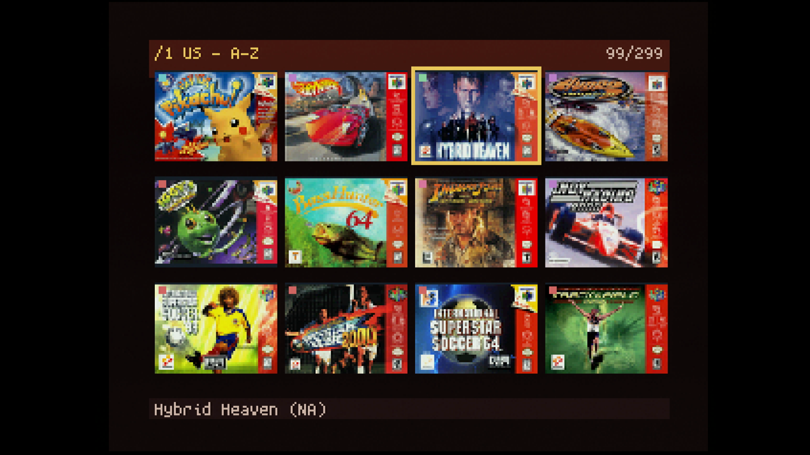
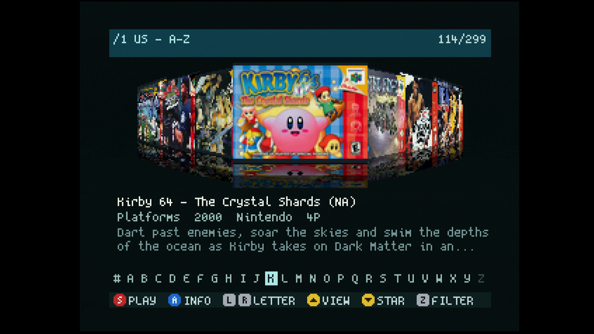
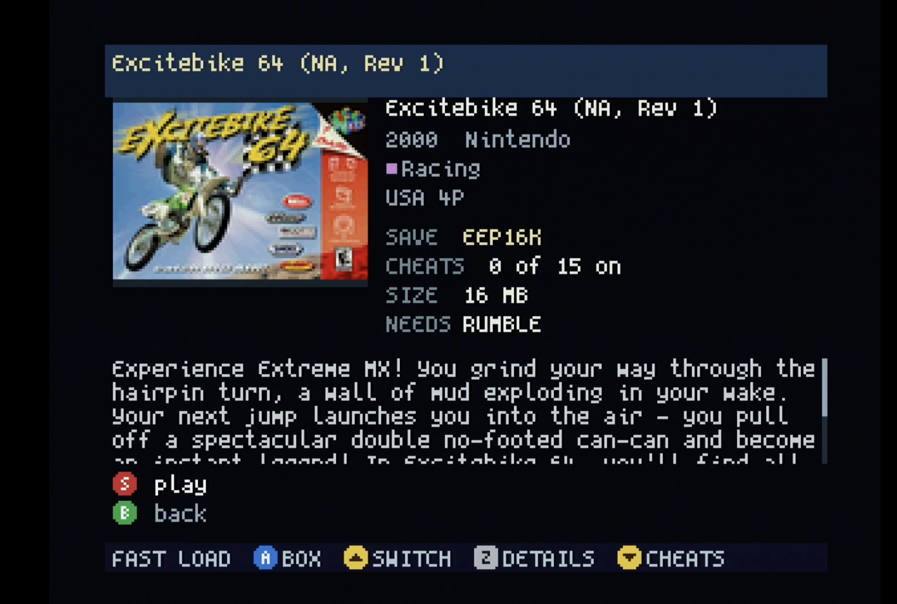
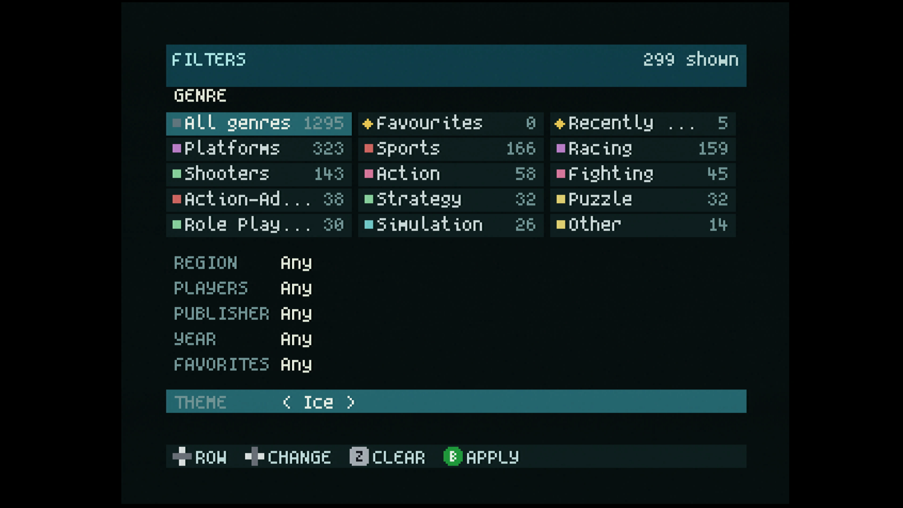

# On the console

What SleekMenu does once it is running. The controls are in the
[README](../README.md#using-it).

## The screens

C-up cycles the three views. The **list** is for a game you can name: the
current folder on the left, the box and the facts of the highlighted game on
the right, and the genre tabs across the top.

The **grid** shows twelve covers at a time, for scanning a folder by eye.



**Coverflow** shows one game face on with its neighbours receding either
side, gliding as you move; hold a direction and the shelf keeps sliding.
Under it are the title, the genre, year, publisher and players, the start
of the description (the rest creeps into view if you stay on a game for
five seconds), and a strip of initials showing where you are. L and R
jump to the next letter of the alphabet instead of paging.



**The details**: A on a game. The box, the year, publisher, genre, region
and players, the save type, how many cheats are on, the size and what the
game needs (a Controller Pak, a Rumble Pak), then the description, which
scrolls. Start plays; C-up switches between a fast and a verified load; C-down
opens the cheats; Z shows the diagnostics.



**The box**, full screen: A on a game's details. It is drawn from
`covers-large.pak`, which the tool writes beside the small pack: the
collection's scan uncropped at its own size, or, after `--hires`, the
512-pixel box fitted to the screen. B goes back; Start still plays.

Z opens the **filter** from any view: genre (with a count for each), region,
players, publisher, year and favourites, combined. Z again clears it, B
applies it. The header shows how many games match. The last row of the
page is not a filter: it is the [theme](#themes).



The bar along the bottom of every screen says what the buttons do on that
screen. Each button is a small picture in the colour it has on the
controller: a blue A, a green B, a red Start with an S, the yellow C
buttons with their arrow, grey Z, L and R, and a cross for the D-pad.

## Themes

The colours are a theme: Midnight, Charcoal, Jungle, Grape, Fire and Ice.
Midnight is the default. To change it, press Z and go to the **THEME** row
under the filters (up from the top row gets there at once): left and right
step through the themes, and the screen takes each one as you do. B keeps
the choice, on the card in `sleekmenu/theme.txt`, and the browser starts in
it from then on. The prep tool sets the same file
([PREP.md](PREP.md#themes)). The buttons' colours, the favourite star, a
warning and an error are the same in every theme.

In the grid and in coverflow, where the genre tabs are not shown, the
title bar names the genre you are in, spelled out.

## Starting the console in SleekMenu

**EverDrive-64 X7.** The stock OS starts a file by itself at power-on when
the card has one: `ED64/autoexec.v64`. SleekMenu only has to be that file.
The prep tool makes it so: tick **Start the console in SleekMenu** on the
prep GUI's Card tab and press Update card
([PREP.md](PREP.md#starting-the-console-in-sleekmenu)). By hand it is a
copy of `SleekMenu64.z64` in the `ED64` folder, renamed `autoexec.v64`;
nothing is converted. From then on:

| You do | You land in |
|---|---|
| Power on | SleekMenu |
| Reset while in SleekMenu | SleekMenu |
| Reset while in a game | the EverDrive menu |

The EverDrive OS still starts first, briefly: it writes the last game's
save to the card, then hands over. Nothing about saves changes. A reset inside a game shows the EverDrive menu because
the OS only starts the file again when the file was the last thing it
launched; `SleekMenu64.z64` is still at the card root to pick from there,
and the next power-on is SleekMenu again. To go back for good, untick the
switch and update the card, or delete `ED64/autoexec.v64`.

**EverDrive-64 Pro.** The Pro's menu is part of its firmware and has no
start-up file, so the console always powers on in the Pro's menu. Start
there opens Recently played, where SleekMenu stays first: games started
from SleekMenu are not added to that list.

## Saves

Written to `ED64/gamedata/` under the EverDrive's own file names. On the X7
the save is moved to the card the next time a menu boots. On the Pro the
cartridge handles saves itself and the stock menu writes them out at its
next boot — so after playing from SleekMenu, let the EverDrive menu boot
once before pulling the card.

## Clock

A game that keeps time (Animal Forest) gets the cartridge's clock as it does
from the stock menu: set at launch on the X7, served by the cartridge on the
Pro.

## Hacks and homebrew

A hack whose author never recomputed the header checksum runs in an emulator
and black-screens on a console. SleekMenu corrects the checksum in cartridge
memory as it launches, the way the EverDrive menu does; the prep tool checks
every hack, translation and homebrew on the card, names the ones whose
checksum is stale, and rewrites them if you tick "Repair hacks that show a
black screen on a console" in the prep GUI (`--fix-checksums` on the
command line).

## ROM formats

`.z64` and `.v64` (byteswapped) dumps load; `.n64` word-swapped dumps are
listed but refused, convert them to `.z64`. Size limit: 64 MiB on the X7,
126 MiB on the Pro.

## 64DD on the Pro

`.ndd` disk images are listed like games. Selected on their own they boot
from the drive's IPL, which the Pro's menu keeps in `ED64/64ddipl/`; a
`.ndd` in the same folder as a cartridge ROM is attached to that ROM as its
expansion disk. Experimental: not yet run on hardware.

## Games added after the last update

The browser reads the folder it is in off the card and lists anything the
catalog does not know — a game you copied on last night, a folder of them —
where its name sorts, under its file name, with an outline where the genre
chip would be and `NOT IN CATALOG` where the box would be. It plays like any
other; the status line says how many are waiting, and the next update gives
them their boxes and facts. Only the folders the browser shows are read:
with the whole library under one folder, a new folder beside it at the card
root is not seen until the card is prepared again. A ROM-shaped file the
tool set aside as not a ROM is known to the browser and never listed.

## Not done yet

Controller Pak (`.mpk`) backup and restore.

## Cheats

GameShark codes, from two places. The EverDrive-64 Pro's menu ships a
cheat pack in `ED64/CHEATS/` (one `.cht` file per game): if that folder is
on your card, there is nothing to set up. And the prep tool fetches
libretro's file for each of your games when you tick **Fetch cheat codes**
([PREP.md](PREP.md#cheat-codes)); those are filed by the exact dump, and
serve the games the pack has no file for, or none for your region. Where
the pack has the game for your cartridge's region, its shorter list is the
one used.

**To use them:** open a game's details, press C-down, tick the codes you
want, press B. Your choices are remembered per game in
`sleekmenu/cheats.txt`. Cheats need an Expansion Pak.

**Which file a game gets.** The pack names its files with short region tags
— `F-Zero X (U).cht`, `F-Zero X (E).cht` — while ROMs are usually named
`F-Zero X (USA).z64`. SleekMenu matches on the game's name and on the
region written inside the ROM, so a USA cartridge gets the `(U)` file and
never European codes. The cheats page shows the file it picked, and warns
when it had to guess.

**When there is nothing to tick:**

- *"Cheat pack has this game for Europe, Japan; yours is USA"* — the pack
  has no file for your region. Codes from another region point at the wrong
  memory addresses and do nothing, so they are not offered.
- *"Not in the cheat pack"* — the pack has files for some 540 games, most
  of the well-known ones, far from all. Fetching libretro's files covers
  more.
- *"WILL NOT RUN"* in red on the card — the console has no Expansion Pak, or
  the game's boot code is not the retail one (hacks, homebrew). The cheats
  page says which.

**Your own codes.** Put a `.cht` file in `sleekmenu/cheats/`, named exactly
like the ROM file (`Super Mario 64 (USA).cht` for `Super Mario 64 (USA).z64`).
It is used instead of a fetched file and of the pack. The format is the pack's own; a cheat made
of several lines of code joins them with `;`:

```text
cheats = 2
cheat0_desc = "Infinite Lives"
cheat0_code = "8033B21D 0064"
cheat1_desc = "99 Coins"
cheat1_code = "8133B218 0063"
```
