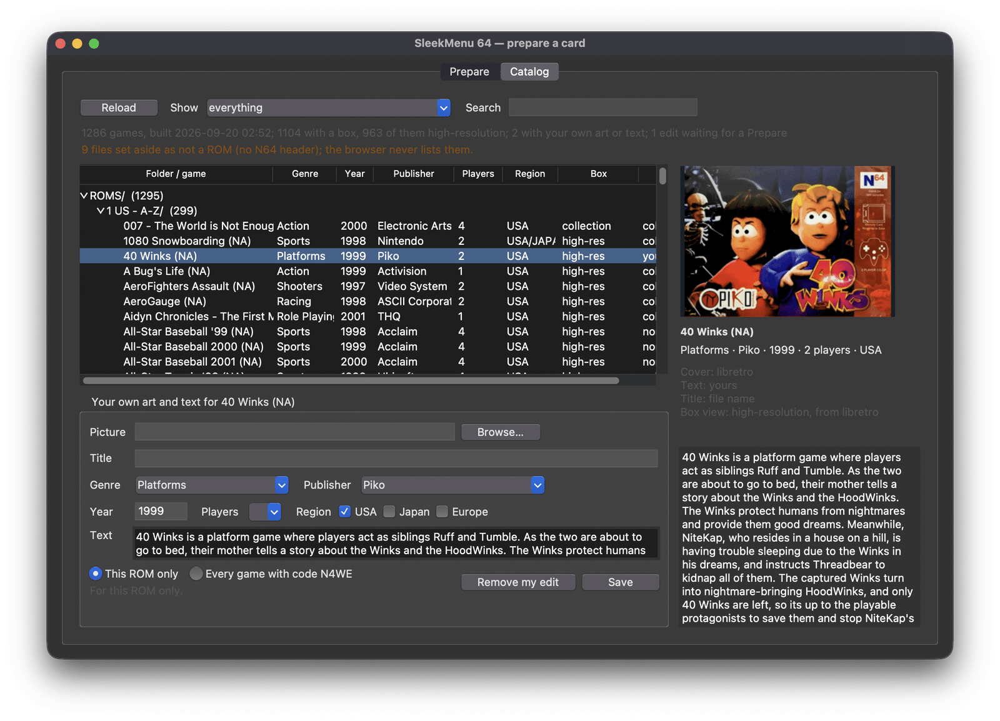

# Preparing a card

The console reads a catalog and a pack of covers that a computer writes onto
the card. The prep GUI and `sleekmenu-prep.pyz` are the same tool, one in a
window and one in a terminal; the [README](../README.md#install) covers the
first run. This is the rest.

## The prep GUI

The same tool as `sleekmenu-prep.pyz`, in a window: pick the card, prepare
it, and see it the way the browser will before it goes back in the
console — every game, its box, where each fact came from — and give any
game your own picture, text or facts.

[Install](../README.md#install) says which download is yours and what to
click the first time. With Python and Tk installed,
`python3 sleekmenu-prep.pyz --gui` opens the same window.

### Card

- **Card** is picked for you when it is the only removable disk; Choose and
  Refresh otherwise.
- **The headline** says what is on it: how many games, how many were copied
  on since the last update, how many have no box. The catalog is built
  here, not on the console, so a game copied on plays from the browser
  straight away but has no box or facts until the next update.
- **Set up card**, the first time, and **Update card** after, do
  everything: read the games, fetch what the card lacks, build the catalog
  and the covers, write them. What it fetches is the collection, once
  (about 52 MB), and a 512-pixel box for each game the database knows
  (about 400 KB each). The four steps show where it is. Stop ends it; what
  was fetched is kept, and the next run carries on from there. A download
  that fails does not stop the run: the card gets its catalog, and the tab
  says what is missing and to press the button again. Show details has the
  report the command line prints.
- **Options**, closed until you open them:
  - *Where the games are*: the whole card, or one folder (`ROMS`) to
    catalog only that. The card remembers the choice.
  - *Repair hacks that show a black screen on a console* rewrites a stale
    header checksum in the file itself. Hacks and homebrew are always
    checked (see [Hacks and homebrew](CONSOLE.md#hacks-and-homebrew)).
  - *Rebuild everything from scratch* reads every ROM and converts every
    box again, and asks libretro again for the boxes it did not have, for
    a card that looks wrong.
  - *Do not download anything* uses only what is already on the card.
  - A `release-metadata.zip` you already have can be chosen in place of
    the download; the line under it says which collection a run will read.

### Games



The card as the browser will show it. The first line counts the games, says
when the catalog was built, how many have a box and how many of those are
high-resolution, how many carry your own art or text, and how many edits
are not on the card yet. The second line, in amber, counts the ROMs copied
on since the last Prepare and the files set aside as not ROMs.

The list follows the card's folders, with the number of games in each.
Every game shows its genre, year, publisher, players and region as the
console will, and in the Box and Text columns where those came from:
`collection`, `other region` (another region's scan of the same game),
`high-res` (libretro), `yours`, or `none`. A row's colour says where it
stands:

| Row | Means |
|---|---|
| plain | in the catalog; this is what the console shows |
| blue | your edit, not yet on the card's catalog |
| amber | on the card but not in the catalog: copied on since the last Prepare, listed by the browser without a box |
| grey | set aside: a ROM-shaped file with no N64 header (a 64DD IPL dump, a broken download), which the browser never lists and Prepare will not add |

Search narrows the list as you type, over the title, the file name, the
publisher, the genre, the year and the game code. Show narrows it to only
what you changed, or only what is not in the catalog. Reload reads the card
again.

Select a game and the right side shows its box exactly as the console draws
it, its facts, where its cover, text and title came from and what the box
view will draw, and its description. The same is in `sleekmenu/catalog.json`
on the card, beside the catalog the console reads.

### Editing a game

The panel under the list holds your own art and text for the selected game.
Choose a picture (Browse, or drop one on the field when your Python has
`tkinterdnd2`), and fill in any of the title, genre, publisher, year,
players, regions and text. An empty field keeps what the card has: in the
screenshot, 40 Winks has its own text, genre, publisher, year and region,
and Players is left empty, so the database's two players stay. "This ROM
only" writes for this one file; "Every game with code …" writes for every
ROM whose header carries that game code — its revisions, and hacks built on
it — and the line under the choice says how many games that reaches.

Save writes exactly the files described in [Your own art and text](#your-own-art-and-text)
into `sleekmenu/art/`, the picture as it is, then puts them in the card's
catalog and covers straight away. That is the same run as Update card,
with the games folder the card remembers and nothing downloaded, and it
takes seconds since only what changed is redone. The console reads only the
catalog, so this run is what makes the edit appear there, the next time
SleekMenu starts. While it runs, or while the card has no collection to
prepare with, the row stays blue, the box shows your picture fitted as the
console will draw it, and the first line counts the edit as waiting.

Remove my edit deletes your files and puts the original back the same way;
the original was never touched.

## Your own art and text

Box art comes from the collection by the game code in the ROM's header, so
a hack gets the box of the game it was built on and homebrew gets none. A
picture of your own, named after the ROM file, wins over the collection.
The tool looks in three places, in this order:

```text
ROMS/Hacks/SM64 Star Road.png       beside the game, same name as the ROM
sleekmenu/art/SM64 Star Road.png    if you keep the ROM folders clean
sleekmenu/art/NSME.png              by game code: every ROM with that code
```

PNG or JPEG, any size; it is fitted like the scans are, and the name can be
in any case. A text file the same way — `SM64 Star Road.txt` beside the
ROM or in `sleekmenu/art/`, or `NSME.txt` there for every game with that
code — becomes the description on the launch card, and header lines at the
top of it set the facts, any of them, in any order:

```text
Title: Super Mario Star Road
Genre: Platforms
Publisher: Skelux
Year: 2011
Players: 1
Regions: USA, Japan

A hack with 120 new stars.
```

Each header wins over the database and the collection for that one field;
the first line that is not a header starts the description. A genre the
card has not seen becomes its own tab on the console. Pictures and text
are read when the tool runs, so a new one needs a re-run of the tool, like
a new game does; Save in the prep GUI does both at once.

**High-resolution boxes.** The collection's scans are 158 pixels wide,
enough for the console's 96×72 thumbnail and no more.
[libretro-thumbnails](https://github.com/libretro-thumbnails/Nintendo_-_Nintendo_64)
keeps a 512-pixel box for every retail cartridge; the prep GUI (and
`--hires` on the command line) fetches one for every game on the card the
database knows, about 400 KB each, into `sleekmenu/art/hires/` by game
code, and builds the covers from those — a 512-pixel box downscaled looks
better than a 158-pixel one downscaled, and the box view (A on a game's
details) draws them at full size. A card that has them keeps them
complete: every later run fetches the boxes of the games added since,
without being asked. Only what is missing is fetched; a game libretro has no box for is noted and not asked
about again unless you pass `--hires` yourself; a picture of your own
still wins; Stop ends it between two boxes. The Games tab counts the
high-resolution boxes and says, for each game, what the box view will
draw.

**From the prep GUI.** The Games tab writes these files for one game or
one game code and puts them on the card as you save: see
[Editing a game](#editing-a-game).

## The command line

`sleekmenu-prep.pyz`, also on the releases page, is the same tool for a
terminal, for anyone with Python 3.9 or newer and
[Pillow](https://python-pillow.org/) (`pip install Pillow`). Copy it to the
root of the card and run it there, with no arguments; running it from the
card is how it knows where the card is.

```sh
cd /Volumes/CARD          # or wherever the card is mounted
python3 sleekmenu-prep.pyz
```

It does what the prep GUI's button does: fetches the collection onto a card
that lacks it, finds every ROM on the card, matches each one to its box and
description, and writes the catalog and the covers. The 512-pixel boxes are
fetched when you ask with `--hires`, and kept complete after. Offline, the card still gets its catalog, without covers, and the
report says where to download the zip by hand — drop it at the root of the
card and run the tool again. The options mirror the GUI's:

- `--roms ROMS` catalogs one folder instead of the whole card, like the
  Games folder field. Only that folder is scanned, the browser opens inside
  it, the report names any ROM-shaped file elsewhere that was left out, and
  the choice holds on the next run; `--roms .` is the whole card again.
- `--hires` fetches the high-resolution boxes; `--rebuild` starts from
  nothing; `--fix-checksums` rewrites a hack's stale header checksum, and
  `--no-checksums` skips the check.
- `--no-download` (or `SLEEKMENU_NO_DOWNLOAD=1` in the environment) keeps
  the tool off the network altogether; `--dry-run` writes nothing.
- `--gui` opens the prep GUI; `--version` says which release it is; `--help`
  lists everything.

## What goes on the card

The box art and descriptions come from
[n64-flashcart-menu-metadata](https://github.com/n64-tools/n64-flashcart-menu-metadata/releases),
a community-maintained collection of box scans and descriptions for every
cartridge, shared with other N64 menus. SleekMenu ships none of it:
Download puts its `release-metadata.zip` on the card, where it is read in
place from then on.

What the tool writes, and what it leaves alone:

```text
/release-metadata.zip      the box-art collection, fetched once and read in place
/sleekmenu/catalog.ebc     titles, genre, publisher, year, descriptions
/sleekmenu/catalog.json    the same, readable, with where every field came from
/sleekmenu/covers.pak      every cover in one file
/sleekmenu/covers-large.pak the same covers at 256×180, for the box view
/sleekmenu/favorites.txt   written by the browser as you star games
/sleekmenu/history.txt     the last fifteen games you launched
/sleekmenu/cheats.txt      which cheats are on, per game
/ED64/gamedata/            saves, shared with the EverDrive menu — never touched
```

Both the catalog and the covers are optional: with no catalog the browser
scans the card and shows filenames, with no covers it draws a placeholder.
The tool never moves, renames or deletes anything on the card, apart from
a picture or text of your own in `sleekmenu/art/` when you press Remove my
edit in the prep GUI.

Every file, who writes it and how a game is matched to its box is in
[CARD_LAYOUT.md](CARD_LAYOUT.md).
