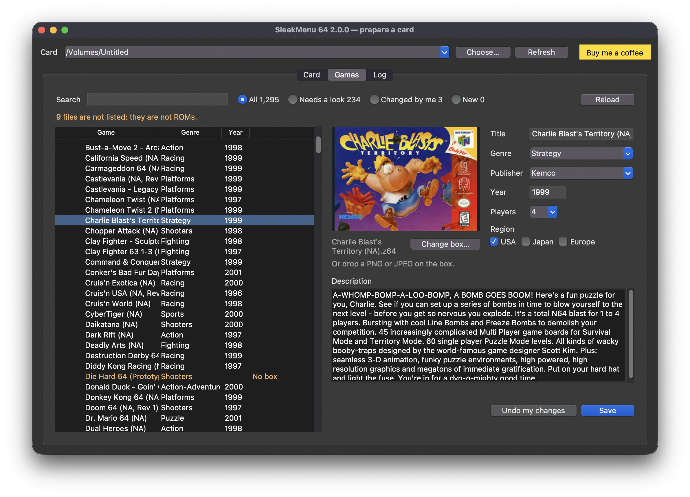

# Preparing a card

The console reads a catalog and a pack of covers that a computer writes onto
the card. The prep GUI and `sleekmenu-prep.pyz` are the same tool, one in a
window and one in a terminal; the [README](../README.md#install) covers the
first run. This is the rest.

## The prep GUI

The same tool as `sleekmenu-prep.pyz`, in a window: pick the card, prepare
it, and see it the way the browser will before it goes back in the
console — every game, its box, its facts — and give any game your own
picture, text or facts.



[Install](../README.md#install) says which download is yours and what to
click the first time. With Python and Tk installed,
`python3 sleekmenu-prep.pyz --gui` opens the same window.

The card is chosen in the row above the tabs, and is the same one on every
tab: it is picked for you when it is the only removable disk; Choose and
Refresh otherwise.

### Card

The card and the one button on the left, the choices that go with it on the
right.

- **The headline** says what is on the card: how many games, how many were
  copied on since the last update, how many have no box. The catalog is
  built here, not on the console, so a game copied on plays from the
  browser straight away but has no box or facts until the next update.
- **Set up card**, the first time, and **Update card** after, do
  everything: read the games, fetch what the card lacks, build the catalog
  and the covers, write them. What it fetches is the collection, once
  (about 52 MB), a 512-pixel box for each game the database knows
  (about 400 KB each) and, if you ticked them, cheat codes. The four steps
  show where it is. Stop ends it; what was fetched is kept, and the next
  run carries on from there. A download that fails does not stop the run:
  the card gets its catalog, and the tab says what is missing and to press
  the button again.

The right side is what most people never change. It applies the next time
you press the button.

**Where the games are**: a path from the card's root, as the console's
title bar writes one. `/` is the whole card; a folder (`/ROMS`) catalogs
only that. The card remembers the choice.

**Downloads**

- **Fetch cheat codes** fetches a file of GameShark codes for every game
  the database knows, for the games the EverDrive's cheat pack does not
  cover; see [Cheat codes](#cheat-codes). Off until you tick it; the card
  remembers that too.
- **Do not download anything** uses only what is already on the card. No
  cheat codes are fetched either, so that box is greyed while this one is
  ticked.
- **Boxes and descriptions**: **Use a zip you have…** takes a
  `release-metadata.zip` you already have in place of the download; the
  line under it says which collection a run will read.

**Repairs**

- **Repair hacks that show a black screen on a console** rewrites a stale
  header checksum in the file itself. Hacks and homebrew are always
  checked (see [Hacks and homebrew](CONSOLE.md#hacks-and-homebrew)).
- **Rebuild everything from scratch** reads every ROM and converts every
  box again, and asks libretro again for the boxes it did not have, for a
  card that looks wrong.

**Console**

- **Theme** picks the browser's colours; the squares beside it show the
  theme's background, title band, selection, accent and text. See
  [Themes](#themes).
- **Start the console in SleekMenu**, on a card for an EverDrive-64 X7,
  makes the console power on in SleekMenu instead of the EverDrive menu.
  See [Starting the console in SleekMenu](#starting-the-console-in-sleekmenu).

### Games

The card as the browser will show it, and the place to change a game.

The list follows the card's folders, with the number of games in each, and
the last column says the one thing worth knowing about a row:

| Row says | Means |
|---|---|
| nothing | in the catalog; this is what the console shows |
| No box, No facts | nothing was found for it: a hack of an unknown game, homebrew |
| Changed by me | it carries a picture, text or facts of your own |
| Edit waiting | your edit is saved but not on the card's catalog yet |
| New | copied on since the last update: the browser lists it without a box until the next one |
| Not a ROM | not listed on the console: a ROM-shaped file with no N64 header (a 64DD IPL dump, a broken download) |

Search narrows the list as you type, over the title, the file name, the
publisher, the genre, the year and the game code. **All**, **Needs a
look**, **Changed by me** and **New** narrow it to those rows, each with
its count; Needs a look is the games with no box or no facts. Reload reads
the card again.

### Editing a game

Select a game and the right side is that game as the console shows it: its
box, drawn exactly as the console draws it, and its title, genre,
publisher, year, players, region and description, each in a field you can
type in. A field marked "· yours" holds a value of your own.

Change what you like and press **Save**. Only what you changed is written:
a field left as the card has it stays the database's or the collection's.
Empty a field to get the original back. **Undo my changes** removes
everything of yours for that game; the original was never touched.

**Change box…** shows the boxes libretro has for the game, one per region
it was released in, beside the one on the card; pick one, or **My own
picture…** for a PNG or JPEG of yours. A picture can also be dropped
straight onto the box, the panel around it or the picker: the downloads
carry what that needs, and from a checkout it is `pip install
tkinterdnd2`. The choice shows in the panel and goes on the card with Save,
as a picture of your own: no later download replaces it.

When the card holds other versions of the game — its revisions, and hacks
built on it, which carry the same game code — **Also change the other
versions of this game** saves the edit for all of them at once.

Save writes exactly the files described in [Your own art and text](#your-own-art-and-text)
into `sleekmenu/art/`, the picture as it is, then puts them in the card's
catalog and covers straight away. That is the same run as Update card,
with the games folder the card remembers and nothing downloaded, and it
takes seconds since only what changed is redone. The console reads only the
catalog, so this run is what makes the edit appear there, the next time
SleekMenu starts. While it runs, or while the card has no collection yet,
the row says Edit waiting and the box shows your picture fitted as the
console will draw it.

### Log

The report of the last run, as the command line prints it.

## Your own art and text

Box art comes from the collection by the game code in the ROM's header, so
a hack gets the box of the game it was built on and homebrew gets none. A
picture of your own, named after the ROM file, wins over the collection.
The tool looks in three places, in this order:

```text
ROMS/Hacks/SM64 Star Road.png       beside the game, same name as the ROM
sleekmenu/art/SM64 Star Road.png    if you keep the ROM folders clean
sleekmenu/art/NSME.png              by game code: every ROM with that code
```

PNG or JPEG, any size; it is fitted like the scans are, and the name can be
in any case. A text file the same way — `SM64 Star Road.txt` beside the
ROM or in `sleekmenu/art/`, or `NSME.txt` there for every game with that
code — becomes the description on the launch card, and header lines at the
top of it set the facts, any of them, in any order:

```text
Title: Super Mario Star Road
Genre: Platforms
Publisher: Skelux
Year: 2011
Players: 1
Regions: USA, Japan

A hack with 120 new stars.
```

Each header wins over the database and the collection for that one field;
the first line that is not a header starts the description. A genre the
card has not seen becomes its own tab on the console. Pictures and text
are read when the tool runs, so a new one needs a re-run of the tool, like
a new game does; Save in the prep GUI does both at once.

**High-resolution boxes.** The collection's scans are 158 pixels wide,
enough for the console's 96×72 thumbnail and no more.
[libretro-thumbnails](https://github.com/libretro-thumbnails/Nintendo_-_Nintendo_64)
keeps a 512-pixel box for every retail cartridge; the prep GUI (and
`--hires` on the command line) fetches one for every game on the card the
database knows, about 400 KB each, into `sleekmenu/art/hires/` by game
code, and builds the covers from those — a 512-pixel box downscaled looks
better than a 158-pixel one downscaled, and the box view (A on a game's
details) draws them at full size. A card that has them keeps them
complete: every later run fetches the boxes of the games added since,
without being asked. Only what is missing is fetched; a game libretro has no box for is noted and not asked
about again unless you pass `--hires` yourself; a picture of your own
still wins; Stop ends it between two boxes.

**From the prep GUI.** The Games tab writes these files for one game or
one game code and puts them on the card as you save: see
[Editing a game](#editing-a-game).

## Cheat codes

Tick **Fetch cheat codes** on the Card tab (`--cheats` on the command
line) and the next run fetches a `.cht` file from
[libretro-database](https://github.com/libretro/libretro-database) for
every game on the card that the database knows by its checksum, most of
them a few KB, into `sleekmenu/cheats/libretro/`. Each file is the one
libretro keeps for that exact dump, region and revision included, and
libretro has one for about three dumps in four — more games than the
EverDrive's own pack covers. A hack gets none: its codes would be its
parent's, written for other addresses.

They are bigger and rougher than the pack's files: most hold a few dozen
codes, some hold thousands, with every variant anyone collected and now and
then a description in German. The console shows the first 256 of a file.
So the pack's file is still the one used where the pack has the game for
your cartridge's region, and a fetched file serves the rest: the games the
pack lacks, has for another region only, or can only guess at.

A card that asked keeps its cheats complete: every later run fetches the
files of the games added since. A game libretro has no file for is noted
and not asked about again, unless you rebuild from scratch. Untick the box
(`--no-cheats`) and nothing more is fetched; the files already on the card
stay, and the console goes on reading them.

On the console a file of your own in `sleekmenu/cheats/`, named like the
ROM, always comes first. See [Cheats](CONSOLE.md#cheats).

## Themes

The browser has six sets of colours, built into `SleekMenu64.z64`:

| Theme | Looks like |
|---|---|
| Midnight | navy with a pale gold accent; the default |
| Charcoal | neutral greys with an orange accent |
| Jungle | deep green with a lime accent |
| Grape | purple with a pink accent |
| Fire | dark red with an amber accent |
| Ice | teal with an ice-blue accent |

Choose one under **Console** on the Card tab (`--theme jungle` on the
command line) and press Update card: the choice is written to
`sleekmenu/theme.txt`, and the browser reads it the next time it starts.
The same file is written by the console itself when you change the theme
there ([CONSOLE.md](CONSOLE.md#themes)), and the window shows whichever was
chosen last. Update card puts a theme on the card only when you picked
another one in the window; otherwise the console's choice stays. A
theme changes colours only: every screen is laid out the same, a warning is
still amber and an error red, and the buttons on the help bar keep the
colours they have on the controller.

## Starting the console in SleekMenu

On an EverDrive-64 X7 the stock OS starts the file `ED64/autoexec.v64` by
itself at power-on, when there is one. The switch on the Card tab
(`--direct-boot on`) copies the card's `SleekMenu64.z64` there, and the
console starts in SleekMenu; unticking it (`--direct-boot off`) removes the
copy, and the console starts in the EverDrive menu again. An update keeps
the copy in step when you replace `SleekMenu64.z64` with a newer one. Leave
`SleekMenu64.z64` at the card root: it is what the copy is made from.

The switch shows only for a card with an X7's OS on it, and is greyed, with
the reason, when it cannot act: the OS is too old to have the feature,
`SleekMenu64.z64` is not on the card yet, or `ED64/autoexec.v64` is some
other program, which is never replaced or removed. What it means on the
console, and why the EverDrive-64 Pro has no such switch, is in
[CONSOLE.md](CONSOLE.md#starting-the-console-in-sleekmenu).

## The command line

`sleekmenu-prep.pyz`, also on the releases page, is the same tool for a
terminal, for anyone with Python 3.9 or newer and
[Pillow](https://python-pillow.org/) (`pip install Pillow`). Copy it to the
root of the card and run it there, with no arguments; running it from the
card is how it knows where the card is.

```sh
cd /Volumes/CARD          # or wherever the card is mounted
python3 sleekmenu-prep.pyz
```

It does what the prep GUI's button does: fetches the collection onto a card
that lacks it, finds every ROM on the card, matches each one to its box and
description, and writes the catalog and the covers. The 512-pixel boxes are
fetched when you ask with `--hires`, and kept complete after. Offline, the card still gets its catalog, without covers, and the
report says where to download the zip by hand — drop it at the root of the
card and run the tool again. The options mirror the GUI's:

- `--roms ROMS` catalogs one folder instead of the whole card, like Where
  the games are. Only that folder is scanned, the browser opens inside
  it, the report names any ROM-shaped file elsewhere that was left out, and
  the choice holds on the next run; `--roms .` is the whole card again.
- `--hires` fetches the high-resolution boxes; `--rebuild` starts from
  nothing; `--fix-checksums` rewrites a hack's stale header checksum, and
  `--no-checksums` skips the check.
- `--cheats` fetches the cheat codes and `--no-cheats` stops;
  `--direct-boot on` and `--direct-boot off` set an X7's start-up switch;
  `--theme` takes a theme's name in lower case (`--theme grape`).
- `--no-download` (or `SLEEKMENU_NO_DOWNLOAD=1` in the environment) keeps
  the tool off the network altogether; `--dry-run` writes nothing.
- `--gui` opens the prep GUI; `--version` says which release it is; `--help`
  lists everything.

## What goes on the card

The box art and descriptions come from
[n64-flashcart-menu-metadata](https://github.com/n64-tools/n64-flashcart-menu-metadata/releases),
a community-maintained collection of box scans and descriptions for every
cartridge, shared with other N64 menus. SleekMenu ships none of it: the
tool puts its `release-metadata.zip` on the card, where it is read in
place from then on.

What the tool writes, and what it leaves alone:

```text
/release-metadata.zip      the box-art collection, fetched once and read in place
/sleekmenu/catalog.ebc     titles, genre, publisher, year, descriptions
/sleekmenu/catalog.json    the same, readable, with where every field came from
/sleekmenu/covers.pak      every cover in one file
/sleekmenu/covers-large.pak the same covers at 256×180, for the box view
/sleekmenu/art/hires/      the 512-pixel boxes, one per game code
/sleekmenu/cheats/libretro/ cheat codes, one file per dump, when asked for
/sleekmenu/theme.txt       the browser's theme, when you chose one
/ED64/autoexec.v64         a copy of SleekMenu64.z64, when an X7 starts in it
/sleekmenu/favorites.txt   written by the browser as you star games
/sleekmenu/history.txt     the last fifteen games you launched
/sleekmenu/cheats.txt      which cheats are on, per game
/ED64/gamedata/            saves, shared with the EverDrive menu — never touched
```

Both the catalog and the covers are optional: with no catalog the browser
scans the card and shows filenames, with no covers it draws a placeholder.
The tool never moves, renames or deletes anything on the card, apart from
two things it put there itself: a picture or text of your own in
`sleekmenu/art/` when you press Undo my changes in the prep GUI, and
`ED64/autoexec.v64` when you untick Start the console in SleekMenu.

Every file, who writes it and how a game is matched to its box is in
[CARD_LAYOUT.md](CARD_LAYOUT.md).
